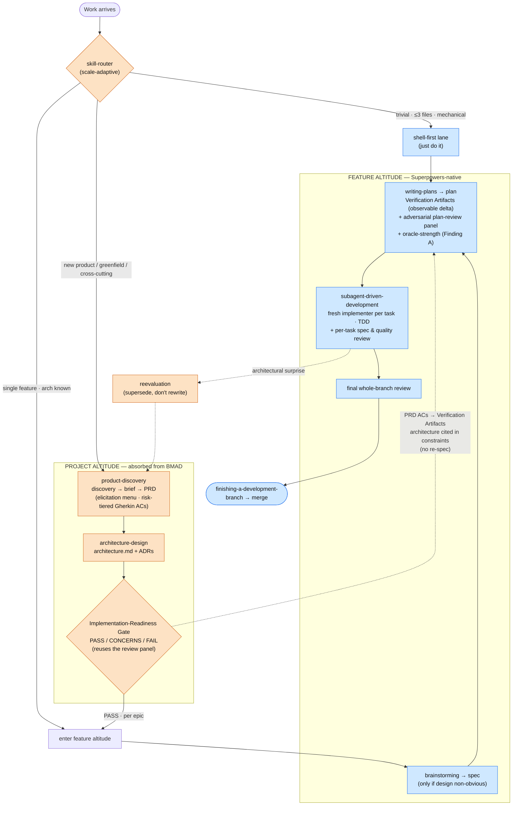

# Happy Path — Unified Planning OS (Superpowers + absorbed BMAD)

This fork absorbed BMAD's effective **project-altitude** capabilities as native skills instead of
integrating a second tool (design: `docs/superpowers/specs/2026-06-19-bmad-absorption-design.md`).
Below is the *happy path*: a greenfield product flowing all the way to merge with every gate
passing. Nodes are colored by origin —
**🟦 Superpowers-native** (upstream + this fork's prior customizations) vs
**🟧 absorbed from BMAD** (the 2026-06-19 batch).

## Flowchart

**Legend:** 🟧 = absorbed from BMAD · 🟦 = Superpowers-native. Solid arrows are the forward happy
path; dotted arrows are the **consumption seam** (feature altitude reads project artifacts, never
re-derives them) and the **upward escalation** loop (an architectural surprise during execution
re-enters the project altitude through `reevaluation`).

## What came from where

| Concern | BMAD (original) | This fork (what we did) | Origin |
|---|---|---|---|
| Routing by scale | scale-adaptive planning | `skill-router` picks altitude by signal, not habit | 🟧 absorbed |
| Discovery → PRD | Analyst + PM phases | `product-discovery`: one continuous pass, findings carry forward (no re-elicit) | 🟧 absorbed |
| Architecture | Architect phase | `architecture-design`: `architecture.md` + ADRs | 🟧 absorbed |
| Readiness check | PASS/CONCERNS/FAIL gate | **reuses the existing multi-lens review panel** — no new gate | 🟧 absorbed (wired to 🟦) |
| Major change | `correct-course` (rewrites completed stories — known bug) | `reevaluation`: **supersede, never rewrite** completed work | 🟧 absorbed + fixed |
| Elicitation | advanced-elicitation menu | shared `elicitation-methods.md` (offered from discovery & brainstorming) | 🟧 absorbed |
| Test strength | TEA risk-based (enterprise) | Finding A: behaviorally-independent assertions, AC→test, mutation when cheap | 🟧 absorbed (lite) |
| Context per work unit | context-rich story files | already native — `writing-plans` embeds full per-task context | 🟦 native |
| Design → plan | (heavy persona handoffs) | `brainstorming` → `writing-plans` (VA observable-delta, input-trust model) | 🟦 native |
| Execution + review | SM / Dev / QA loop | `subagent-driven-development` + per-task & whole-branch review | 🟦 native |
| Merge | — | `finishing-a-development-branch` | 🟦 native |

## Deliberately NOT taken from BMAD

Every practitioner source names solo developers as BMAD's worst fit, so we took the signal and
rejected the ceremony:

- **12+ personas** (Mary/John/Winston…) — existing skills already cover the roles.
- **Document sharding** — BMAD itself deprecates it (a context-window workaround).
- **"Party mode" debate** — already covered by the multi-lens adversarial review panel.
- **Review-issue quotas** (min 3 issues per review) — an anti-pattern; the fork forbids it.
- **Sprint machinery** (`sprint-status.yaml`) — single-operator, no sprints.
- **TEA enterprise test module** — only its assertion-strength idea was extracted (Finding A).

## The seam in one sentence

The project altitude writes durable artifacts (PRD + `architecture.md` + ADRs); the feature
altitude **reads** them — PRD acceptance criteria become `writing-plans` Verification Artifacts and
the architecture is cited in plan constraints — so neither side re-does the other's work, and a
mid-build architectural surprise escalates up to `reevaluation` instead of being quietly redesigned
inside a plan.
