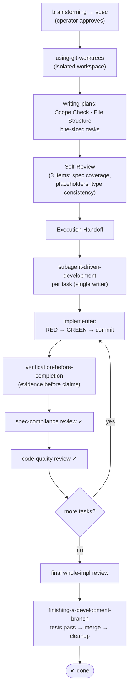
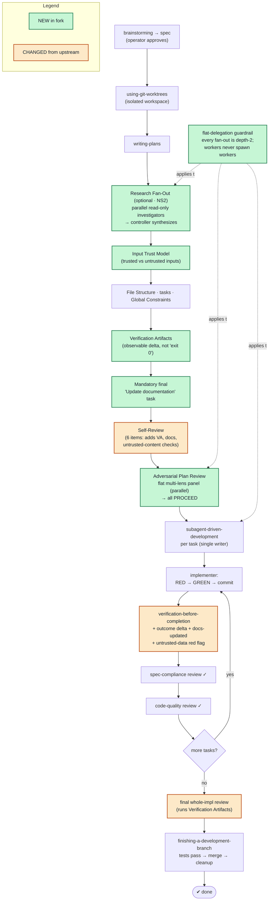

# Fork Workflow — Happy Path

This fork customizes the Superpowers planning/execution pipeline. The diagrams below
show the **happy path** (everything passes, no `revise` loops) for upstream Superpowers
and for this fork, with the fork's additions highlighted.

In the fork chart: **green = new in this fork**, **amber = changed from upstream**,
default-styled nodes are the unchanged backbone.

> Rendering: view this file in a Mermaid-aware viewer (GitHub, mermaid.live, VS Code
> Mermaid preview) to see the colored boxes. Raw text won't show color.

## 1. Original Superpowers — happy path

## 2. This fork — happy path (green = new, amber = changed)

## The diff at a glance

- **New** (green): Research Fan-Out · Input Trust Model · Verification Artifacts ·
  Mandatory docs task · Adversarial Plan Review (multi-lens panel) · flat-delegation guardrail
- **Changed** (amber): Self-Review (3 → 6 items) · verification-before-completion
  (adds outcome-delta, docs-updated, untrusted-data red flag) · final review now executes
  the Verification Artifacts
- **Unchanged backbone:** brainstorming → using-git-worktrees → writing-plans →
  subagent-driven-development (implementer + two-stage review loop) → finishing-a-development-branch

All fork additions are **advisory** (operator may override any gate) and **flat depth-2,
read-only** where they fan out — matching the research finding that parallel read/review
fan-out helps while nested subagents-calling-subagents does not. The deterministic structural
lint `scripts/lint-fork-customizations.sh` (no LLM, 49 checks) guards these behaviors.

## Two newer arcs (layered on the pipeline above)

The charts above are the day-to-day **feature** pipeline. Two later arcs extend it:

- **Project altitude (BMAD absorption).** Larger work is first routed by `skill-router`: greenfield
  / cross-cutting work runs `product-discovery` → `architecture-design` → an
  implementation-readiness gate, then drops per-epic into the feature pipeline above, which *reads*
  those project artifacts instead of re-deriving them. Full diagram and "what came from where":
  [`docs/superpowers/bmad-absorption-happy-path.md`](superpowers/bmad-absorption-happy-path.md).
- **Project-memory curation.** At completion, `finishing-a-development-branch` runs a
  `curating-project-memory` pass that drifts the project's `CLAUDE.md` (canonical) / generated
  `AGENTS.md` / scoped `.claude/rules/` / `docs/` toward an optimal, well-linked state;
  `writing-plans`' final documentation task now names `CLAUDE.md` / `AGENTS.md`, and
  `verification-before-completion` checks that project memory is current. Design:
  [`docs/superpowers/specs/2026-06-22-project-memory-curation-design.md`](superpowers/specs/2026-06-22-project-memory-curation-design.md).
